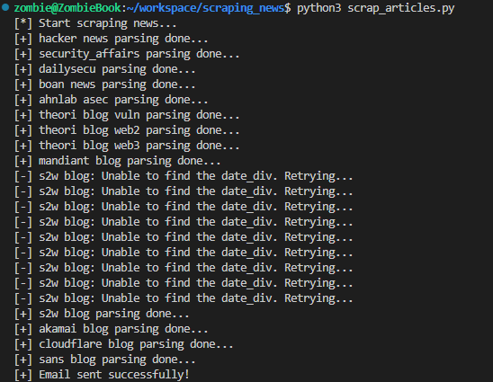
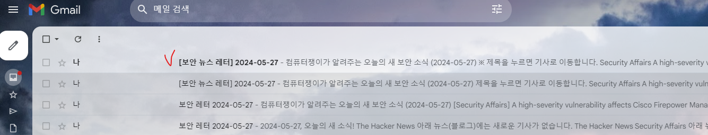

# 보안 관련 뉴스 및 블로그 크롤링 스크립트 개발

## 동기:

- 아침마다 최신 취약점, 보안 동향을 파악하기 위하여 각종 뉴스 사이트/블로그를 확인해야 하나, 여기저기 **산재**되어있어 모든 사이트를 방문하기가 번거로움을 느꼈다.
- 이를 해결하기 위하여 모든 사이트를 **자동으로 방문**하고, 새 게시물이 존재하면 **이를 알려주는** 스크립트를 개발하면 편리해지겠다고 생각하였다.

## **목표:**

- 보안과 관련된 온라인 컨텐츠를 자동으로 추적하여 신규 게시물을 검색하고 수집함으로써 보안 업데이트에 대한 신속한 정보를 제공하도록 한다.
- 자동화된 크롤링 기능을 통해 사용자의 시간을 절약, 한눈에 새 게시물을 파악할 수 있도록 한다.

## **기능 및 시나리오:**

1. 매일 0700시에 새 게시물이 올라왔는지 **확인**한다.
2. 당일 날짜로 새로운 게시물이 존재한다면 해당 페이지를 **크롤링**하여 제목, 작성자, 게시 일자 등의 정보를 수집한다.
3. 수집된 정보를 사용자에게 **알림**으로 제공한다. (예: 이메일 알림, 텍스트 메시지 등)

## **요구 기술 스택:**

- Python 프로그래밍 기술
- 웹 크롤링 및 데이터 추출을 위한 라이브러리 (예: BeautifulSoup)
- 크롤링 대상 웹사이트의 구조 파악
    - 웹사이트의 HTML 구조를 파악할 줄 알아야 한다. 각 사이트마다 게시물 제목, 작성자, 게시 일자 등을 포함한 요소들을 파악하여 데이터를 추출할 요소를 선택해야 하기 때문이다.
- 사이트의 컨텐츠를 동적으로 로드할 경우 이를 가져올 라이브러리 (예: Selenium)
- 알림 기능을 위한 이메일 라이브러리 (예: smtplib)
    - **`smptlib`**은 Python에서 이메일을 보내는 데 사용되는 내장 라이브러리이다. 이 라이브러리를 사용하여 SMTP(Simple Mail Transfer Protocol)를 통해 이메일을 보낼 수 있다.
- 필요 시 데이터베이스를 사용하여 수집된 정보를 저장하고 관리 (예: SQLite)

## 방문할 사이트 분석:

### 뉴스

| 사이트명 | 주소 | 수집 대상 URL | 수집 내용 | 정적/동적 | 크롤링 허가 여부 |
| --- | --- | --- | --- | --- | --- |
| The Hacker News | https://thehackernews.com/ | https://thehackernews.com/
https://feeds.feedburner.com/TheHackersNews | 제목, url, 요약, 태그(있다면), 날짜 | 정적 | O |
| Security Affairs | https://securityaffairs.com/ | https://securityaffairs.com/?page=1#latest_news_section 
https://securityaffairs.com/?page=1#latest_news_section | 제목, url, 요약, 태그, 날짜 | 정적 | robots.txt 존재X |
| 보안뉴스 | https://www.boannews.com/ | https://www.boannews.com/media/list.asp?mkind=1 | 제목, url, 요약, 날짜 | 정적 | O |
| 데일리시큐 | https://www.dailysecu.com/ | https://www.dailysecu.com/news/articleList.html?view_type=sm | 제목, url, 요약, 태그, 날짜 | 정적 | O |
- The Hacker News
    - 각 기사는 **‘body-post clear’** 라는 클래스 내에 존재한다. 한 페이지당 12개의 기사가 표시되며, 그중 하나는 광고이다. 하루당 최신 기사는 약 3~4개정도 올라므로 첫 페이지를 스크래핑하여 12개의 기사의 요약만 받아 리스트에 저장해 놓으면 된다.
        
        
        
        
        
        beautifulsoup 라이브러리를 이용하여 아래 내용만 뽑아낼 수 있었다. 제목, 기사 url, 날짜, (존재한다면) 태그, 간략한 내용.
        
        Guide: Secure Your Privileged Access ~ 는 광고이므로 제외하고 11개 읽어오는 것을 확인할 수 있다.
        
        
        
        - 403 에러 발생으로, RSS 피드에서 내용을 가져오는 것으로 수정
        
        
        
    - 자동 수집 내용 제한
        - 사이트맵 외에는 자동수집을 허용하고 있다.
        
        
        
- Security Affairs
    - 페이지당 기사를 **4**개씩 보여주며, 최신 글을 확인하려면 적어도 2페이지까지 확인해야 함:
        
        
        
        
        
        
        
        
        
- Boan News
    - 각 기사들은 new_list로 묶여있으며, tag가 따로 없어 그 부분은 제외하고 수집해야 한다.
        
        
        
        
        
        
        
    - robots.txt
        
        
        
- Daily Secu
    - 각 기사는 list-block 아래 묶여 있으며, 제목/url/내용/날짜/태그를 수집할 수 있다.
        
        
        
        
        
        
        
    - robots.txt
        
        
        

### 블로그

| 사이트명 | 주소 | 수집 대상 URL | 수집 내용 | 정적/동적 | 크롤링 허가 여부 |  |
| --- | --- | --- | --- | --- | --- | --- |
| 안랩 ASEC | https://asec.ahnlab.com/ko/ | https://asec.ahnlab.com/ko/ | 제목, url, 요약, 날짜 | 정적 | O |  |
| Theori | https://blog.theori.io/ | https://blog.theori.io/vulnerability-research/home
https://blog.theori.io/web2/home
https://blog.theori.io/web3/home | 제목, url, 태그, 요약, 날짜 | 정적+동적 | O |  |
| Mandiant | https://www.mandiant.com/resources/blog | https://www.mandiant.com/resources/blog | 제목, url, 날짜 | 정적 | O |  |
| S2W | https://s2w.medium.com/ | https://s2w.medium.com/ | 제목, url, 날짜 | 정적 | O |  |
| Akami | https://www.akamai.com/ko/blog | https://www.akamai.com/ko/blog
https://feeds.feedburner.com/akamai/blog | 제목, url, 태그, 요약, 날짜 | 동적
정적 | O |  |
| Cloudflare | https://blog.cloudflare.com/tag/security | https://blog.cloudflare.com/tag/security | 제목, url, 태그(있다면), 요약, 날짜 | 정적 | O |  |
| Sans | https://www.sans.org/blog/ | https://www.sans.org/blog/ | 제목, url, 태그, 요약, 날짜 | 동적 | O |  |
- 안랩 ASEC Blog
    - 기사 페이지의 모습
        
        
        
    - 각 기사는 article 태그로 묶여 있으며, 제목/날짜/내용/url 을 수집한다.
        
        
        
        
        
    - robots.txt
        
        
        
- Theori Blog
    - 메인 화면에서 각 섹션에 대한 글을 3개씩 보여준다.
        
        
        
    - 글들은 <section~ 의 태그로 묶여있으며, 최신 글 / Trending / Vulnerability Research / Web2 Security / Web3 Security / Culture의 6개 섹션으로 나뉘어 있다. 이 중 3~5번째 섹션만 가져 올 것이며, 각 섹션의 이름은 태그로 사용할 것이다.
        - 확인 해 보니, 절반은 정적으로 가져오고, 나머지 3개의 섹션은 동적으로 가져온다.
        - 번거로워지므로, 각 태그로 들어가, 가장 상단의 글 하나만 가져오도록 한다. 즉 세번의 요청을 하는 셈.
    - **유니코드 특수문자를 hex에서 표시되도록 바꿔주어야 한다.**
    - 글 목록은 크게는 div로 묶여 있으며, streamItem streamItem--section js-streamItem 클래스의 2번째 인덱스부터가 수집하려는 기사 목록이다.
        
        
        
        
        
    - robots.txt
        
        
        
- Mandiant Blog
    - 한 페이지당 총 9개의 글을 보여준다.
        
        
        
    - 각 글은 resources-card라는 클래스로 묶여 있으며, 수집 가능한 정보는 제목, url, 날짜이다.
        
        
        
        
        
    - robots.txt: blog에 대한 내용은 없으므로 수집 가능한 것으로 판단된다.
        
        
        
- S2W Blog
    - 많은 기사들이 있으며, 가장 상단의 기사는 옛날 글이더라도 pinned 라는 문구와 함께 고정되어 있다. 블로그는 반응형으로 보이며, 스크롤을 아래로 내릴수록 이전 글이 더 보인다.
    - 주의할 사항으로는 응답이 느려 timeout을 20으로 주지 않으면 오류가 발생한다는 것이다.
        
        
        
        
        
        
        
    - robots.txt
        
        
        
- Akami Blog
    - 한 페이지에는 12개의 기사가 보인다. 수집할 수 있는 내용으로는 제목 / 요약 / 날짜 / url / 태그로 확인된다.
        
        
        
    - 각 포스트는 div 태그로 묶여 있으며, card post post —akamai:blogs/ 까지 동일한 클래스를 가진다.
    - 그러나 실제로 해당 사이트에 접근하여 html을 가져왔을 때, 블로그 기사 내용은 불러와지지 않았다. 이로 보아, 기사는 동적으로 가져오는 것 같았고, 이를 위해서는 Selenium를 이용해야 한다.
        
        
        
        
        
        item 아래 모든 값을 가져오면, 반환하는 값이 너무 많아 오류가 발생하게 된다. 15개로 제한하여 가져오도록 하였다.
        
    - robots.txt
        
        
        
- Cloudflare Blog
    - Security: 최근 기사가 위에 5개만 표시된다. 이 다섯개만 가져오도록 한다.
        
        
        
    - main 태그 아래 article 태그들이 각 기사이다.
        
        
        
    - robots.txt
        
        
        
- Sans Blog
    - 한 페이지에는 총 10개의 기사가 올라온다.
        
        
        
    - **각 기사는 article-listing__item 클래스로 구분할 수 있다. 스크래핑을 시도하였으나 기사 내용은 들어있지 않은 값이 리턴되었다. 이것으로 보아 해당 사이트는 기사를 동적으로 가져오는것으로 추측된다.**
        
        
        
        
        
        개발자 모드에서 js 사용 중지 후 새로고침을 했을 때 로딩되지 않는 것을 보아, 각 기사들은 JS를 통해 동적으로 불러온다는 것을 알 수 있다.
        
    - robots.txt: 리스트는 길지만, Disallow 부분에 blog 내용은 없으므로 크롤링에 문제가 없다고 판단하였다.
        
        
        

## **진행 계획:**

**1주차 (5월 6일 - 5월 12일):**

- ~~웹사이트 구조 파악 및 데이터 추출 방법에 대한 조사~~
- ~~크롤링을 위한 기본적인 Python 스크립트 작성~~
- ~~필요한 라이브러리 설치 및 환경 설정~~

**2주차 (5월 13일 - 5월 20일):**

- ~~개발된 스크립트를 사용하여 한 개의 사이트에서 데이터를 추출하고 저장하는 기능 구현~~
- 알림 기능에 대한 연구 및 이메일 라이브러리를 통한 알림 구현

**3주차 (5월 21일 - 5월 27일):**

- ~~다른 사이트에서의 데이터 추출 및 저장 기능 추가~~
- 전반적인 코드 리팩토링 및 최적화

**4주차 (5월 28일 - 6월 2일):**

- 시스템 테스트 및 디버깅
- 문서화 작업: 사용법, 코드 설명, 설정 방법 등의 문서 작성
- 최종 프로젝트 검토 및 완료

## 예상 결과 화면:

- 요약 메일을 보낼 때 다음과 같은 html 템플릿을 포함하도록 한다. 오늘 발행된 기사가 없으면 해당 부분에는 “**오늘은 새로운 글이 없습니다**”라는 문구를 표시한다.
    
    
        
## 실제 결과 화면

1. 실행 시 콘솔에 아래와 같이 결과가 출력된다.
    
    
2. Gmail 접속 시 메일이 온 것을 확인 가능
    
    

## 보완해야 할 점

1. 에러 처리
    - 홈페이지 연결이 제대로 안 될 경우
    - 메일 실패 시 에러처리
2. 페이지들의 구성이 바뀐다면? 태그 내용만 가지고 오기에는 무리가 있어 보임
    1. 겉모습에 영향을 받지 않는 더 기초적인 데이터들이 필요

## 배우게 된 내용 & 참고 내용:

- 크롤링(requests, beautifulsoup 라이브러리 사용): [https://wikidocs.net/85739](https://wikidocs.net/85739)
- [https://www.youtube.com/watch?v=Ev4IZnphTkg&ab_channel=보안프로젝트[boanproject]](https://www.youtube.com/watch?v=Ev4IZnphTkg&ab_channel=%EB%B3%B4%EC%95%88%ED%94%84%EB%A1%9C%EC%A0%9D%ED%8A%B8%5Bboanproject%5D)
- 스크래핑 시 주의해야 할 점: [https://advenoh.tistory.com/3](https://advenoh.tistory.com/3)
- 크롤링 걸리지 않는 법(?): [https://blog.hashscraper.com/5-principles-for-bypassing-web-crawling-blocks/](https://blog.hashscraper.com/5-principles-for-bypassing-web-crawling-blocks/)
    - 어떤 사이트들은 무분별한 봇의 접근/크롤링을 막기 위해 헤더의 User-Agent 값을 검사한다.
    - 심지어 오래된 버전의 User-agent는 차단해 놓기도 하니, 나의 User-agent를 확인하여 쓰는 것이 좋다. : [https://www.useragentstring.com/](https://www.useragentstring.com/)
- request시 SSL 오류: [https://cho001.tistory.com/151](https://cho001.tistory.com/151)
- 웹 크롤링 허가 여부 확인하기: [https://brunch.co.kr/@8d1b089f514b4d5/35](https://brunch.co.kr/@8d1b089f514b4d5/35)
- Selenium 이용하기
    - [https://velog.io/@dlalscjf94/Python-셀레니움-크롤링-시-매우-유용한-라이브러리webdrivermanager](https://velog.io/@dlalscjf94/Python-%EC%85%80%EB%A0%88%EB%8B%88%EC%9B%80-%ED%81%AC%EB%A1%A4%EB%A7%81-%EC%8B%9C-%EB%A7%A4%EC%9A%B0-%EC%9C%A0%EC%9A%A9%ED%95%9C-%EB%9D%BC%EC%9D%B4%EB%B8%8C%EB%9F%AC%EB%A6%ACwebdrivermanager)
    - 아래 내용 설치 전 apt update, apt upgrade 실행.
    - **Install Google Chrome**
        
        ```python
        wget https://dl.google.com/linux/direct/google-chrome-stable_current_amd64.deb
        sudo apt update
        sudo apt install ./google-chrome-stable_current_amd64.deb
        
        ```
        
    - **Install ChromeDriver**
        
        ```python
        wget https://chromedriver.storage.googleapis.com/$(wget -qO- https://chromedriver.storage.googleapis.com/LATEST_RELEASE)/chromedriver_linux64.zip
        unzip chromedriver_linux64.zip
        sudo mv chromedriver /usr/local/bin/
        
        ```
        
    - **Install Python Packages**
        
        ```python
        pip install selenium webdriver-manager
        
        ```
        
- Python - stmplib 사용
    - [https://icedhotchoco.tistory.com/entry/sending-email-with-python](https://icedhotchoco.tistory.com/entry/sending-email-with-python)
    - 아래와 같은 에러가 뜨면, 구글에서 앱 비밀번호를 지정해야 함
    
    ```shell
    smtplib.SMTPAuthenticationError: (535, b'5.7.8 Username and Password not accepted. For more information, go to\n5.7.8  https://support.google.com/mail/?p=BadCredentials 41be03b00d2f7-682226fb2e8sm2393351a12.40 - gsmtp')
    ```
    
    ```shell
    export EMAIL_ADDRESS=여기의 자신의 지메일 주소를 넣는다.
    export EMAIL_PASSWORD=여기에 앱 비밀번호를 넣는다.
    ```

