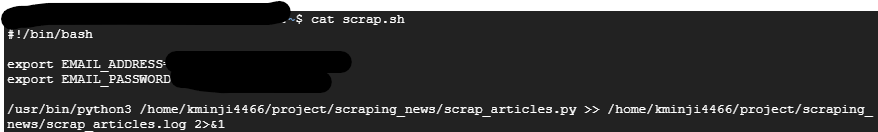
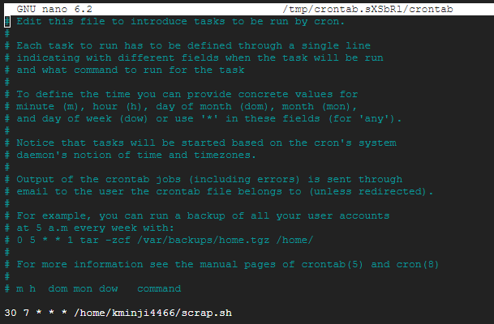
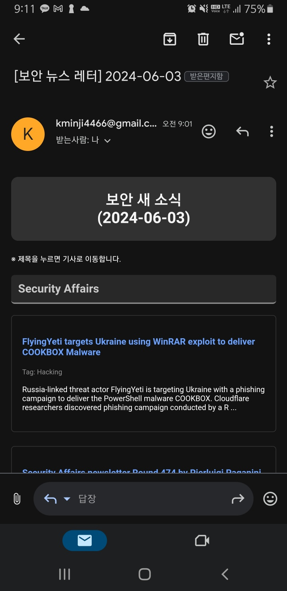

# 보안 관련 뉴스 및 블로그 크롤링 스크립트 개발
여러 보안 뉴스 및 블로그 웹사이트에서 최신 기사를 스크래핑한 후, 이를 HTML에 담아 이메일로 보내는 파이썬 스크립트임.

## 기능

- 여러 보안 웹사이트에서 기사를 스크래핑
- 기사를 잘 정리된 HTML 형식으로 변환
- HTML 내용을 이메일로 전송

## 필요 조건

- Python 3.x
- 필요한 파이썬 패키지:
  - `requests`
  - `beautifulsoup4`
  - `smtplib`
  - `datetime`
  - `os`
  - `selenium`

- selenium 설치 방법
    - **Install Google Chrome**
    ```shell
    wget https://dl.google.com/linux/direct/google-chrome-stable_current_amd64.deb
    sudo apt update
    sudo apt install ./google-chrome-stable_current_amd64.deb
    ```
    
    - **Install ChromeDriver**
    ```shell
    wget https://chromedriver.storage.googleapis.com/$(wget -qO- https://chromedriver.storage.googleapis.com/LATEST_RELEASE)/chromedriver_linux64.zip
    unzip chromedriver_linux64.zip
    sudo mv chromedriver /usr/local/bin/
    ```
    
    - **Install Python Packages**
    ```shell
    pip install selenium webdriver-manager
    ```

## 스크립트 내용
1. **scrap_articles.py**
    - scraping_functions.py에서 스크래핑 함수를 가져온다.
    - 기사를 HTML 형식으로 컴파일한다.
    - HTML 내용을 이메일로 전송한다.

2. **scraping_functions.py**
    - 여러 보안 웹사이트에서 기사를 스크래핑하는 개별 함수를 포함하고 있다.
    - 각 함수는 기사 제목, 날짜, URL, 태그, 내용과 같은 세부 정보를 포함하는 딕셔너리의 리스트를 반환한다.
    - 다음과 같은 스크래핑 함수가 포함되어 있음:
        - hacker_news(): The Hacker News에서 기사를 스크래핑
        - security_affairs(): Security Affairs에서 기사를 스크래핑
        - daily_secu(): 데일리시큐에서 기사를 스크래핑
        - boan_news(): 보안뉴스에서 기사를 스크래핑
        - ahnlab_asec(): 안랩 ASEC Blog에서 기사를 스크래핑
        - theori_blog(): Theori Blog에서 기사를 스크래핑
        - mandiant_blog(): Mandiant Blog에서 기사를 스크래핑
        - s2w_blog(): S2W Blog에서 기사를 스크래핑
        - akamai_blog(): Akamai Blog에서 기사를 스크래핑
        - cloudflare_blog(): Cloudflare Blog에서 기사를 스크래핑
        - sans_blog(): SANS Blog에서 기사를 스크래핑

## Gmail 사용하기(stmplib)
- 사용 전 gmail에서 여러 설정 및 앱 비밀번호 생성이 필요함.
    ```shell
    export EMAIL_ADDRESS='당신의 메일 주소'
    export EMAIL_PASSWORD='당신의 앱 비밀번호'
    ```

## 결과 화면
- shell
   
- crontab   
   
- 결과 화면   
   

## 보완해야 할 점

1. 에러 처리
    - 홈페이지 연결이 제대로 안 될 경우를 고려 필요하다.
    - 메일 실패 시 에러처리가 필요하다.
2. 페이지들의 구성이 바뀐다면? 태그 내용만 가지고 오기에는 무리가 있어 보인다.
    - 겉모습에 영향을 받지 않는 더 기초적인 데이터들이 필요하다.